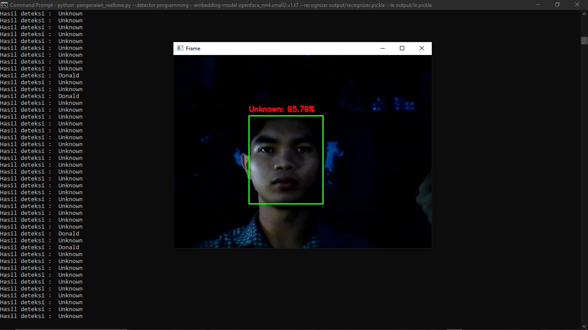

Oke, aku buatkan **README.md** yang rapi, menarik, dan cocok untuk GitHub. Kita tambahkan juga bagian tentang hasil deteksi kamera (menampilkan nama orang dari dataset, misalnya *Donal* dengan persentase kecocokan, atau *Unknown* jika tidak dikenal).

Berikut contoh **README.md** yang bisa langsung dipakai:

---

# 🖥️ Face Recognition with CNN


## 📌 Deskripsi

Proyek ini adalah **Face Recognition (Pengenalan Wajah)** berbasis **Convolutional Neural Network (CNN)** menggunakan **OpenCV** dan **dlib**.
Program ini dapat:

✅ Membuat dataset wajah dari kamera
✅ Melatih dataset agar dapat dikenali
✅ Menjalankan pengenalan wajah secara real-time melalui kamera
✅ Menampilkan **nama orang yang dikenali** beserta **persentase kecocokan**
✅ Jika wajah tidak ada dalam dataset, akan ditampilkan sebagai **Unknown**

---

## 🛠️ Teknologi yang Digunakan

* [Python 3.8+](https://www.python.org/)
* [OpenCV](https://opencv.org/)
* [dlib](http://dlib.net/)
* Pre-trained CNN model `openface_nn4.small2.v1.t7`

---

## 📂 Struktur Proyek

```
📦 Face Recognition Project
 ┣ 📜 buat_dataset.py        # Script untuk membuat dataset wajah
 ┣ 📜 pelatihan_dataset.py   # Script untuk melabeli & melatih dataset
 ┣ 📜 pengenalan_realtime.py # Script utama untuk deteksi wajah real-time
 ┣ 📜 openface_nn4.small2.v1.t7 # Pre-trained model CNN
 ┗ 📜 README.md
```

---

## 🚀 Cara Menjalankan

### 1️⃣ **Persiapan**

* Pastikan Python sudah terinstall
* Buat virtual environment (opsional tapi disarankan)
* Install semua library yang diperlukan:

```bash
pip install -r requirements.txt
```

Contoh isi `requirements.txt`:

```
opencv-python
dlib
numpy
```

---

### 2️⃣ **Membuat Dataset**

Jalankan script berikut untuk mengambil foto wajah dari kamera:

```bash
python buat_dataset.py
```

Dataset akan otomatis disimpan dengan nama sesuai input.

---

### 3️⃣ **Melatih Dataset**

Setelah dataset dibuat, jalankan pelatihan:

```bash
python pelatihan_dataset.py
```

Script ini akan membuat model yang siap digunakan untuk pengenalan wajah.

---

### 4️⃣ **Menjalankan Pengenalan Wajah Real-time**

Terakhir, jalankan pengenalan wajah secara langsung melalui kamera:

```bash
python pengenalan_realtime.py
```

* Jika wajah dikenali, akan muncul **nama & persentase kecocokan**, contoh:

```
Donal (95.3%)
```

* Jika wajah tidak dikenal, akan muncul **Unknown**.

Untuk keluar dari kamera, tekan **Q**.

---

## 📸 Contoh Hasil

✅ **Wajah dikenali**

```

```

✅ **Wajah tidak dikenali**

```

```

## ➕ Menambahkan Wajah Baru

Untuk menambahkan orang baru ke dalam sistem:

1. Jalankan `buat_dataset.py` dan buat dataset wajah baru
2. Jalankan ulang `pelatihan_dataset.py`
3. Jalankan `pengenalan_realtime.py` untuk menguji

---

## 🎯 Fitur yang Akan Dikembangkan

* ✅ Deteksi multi-wajah secara bersamaan
* ✅ Penyimpanan hasil deteksi ke dalam log
* ✅ Integrasi dengan database untuk dataset wajah

---

